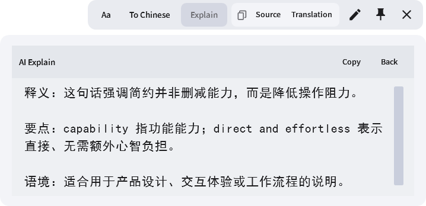

<p align="center">
  
</p>

<h1 align="center">InstantTranslate</h1>

<p align="center">Windows 全局划词翻译 · DeepSeek 流式响应 · 安静、快速、默认不留记录</p>

InstantTranslate 是一个个人自用、可开源的 Windows 划词翻译工具。在大多数可选择文字的应用中拖选文本，它会读取选区、调用 DeepSeek，并在鼠标附近显示不抢焦点的译文浮窗。

## 效果预览

### Bubble 2.0


### AI Explain



## 15 秒开始使用

1. 下载并解压 `InstantTranslate-v0.7.0-win-x64.zip`。
2. 运行 `InstantTranslate.exe`；首次启动会打开设置。
3. 填写 DeepSeek API Key，点击“Test connection”（切换中文后为“测试连接”），成功后保存。
4. 在记事本、浏览器或文档中用鼠标拖选文字。

程序常驻系统托盘。再次双击 EXE 不会重复安装鼠标钩子，而会唤起已有实例的设置页。

## AI Explain

- 译文完成后，功能栏中的 `Explain / 解释` 会用 DeepSeek 对本次原始划词内容作简洁中文讲解，按“释义、要点、语境”组织并流式显示。
- 功能栏中的 `Code / 代码` 会把本次原始划词作为代码片段分析，自动判断最可能的语言（如 C、C++、C#、Python、JavaScript、SQL、Shell、配置或标记语言），并按“语言判断、常见用途、代码作用、关键逻辑、替代与注意”流式说明；不需要预先指定语言。
- 在译文正文中选中一段文字，会在选区附近出现独立的 `Explain / 解释` 按钮；该操作只解释所选译文，不会再次触发全局划词翻译。
- 解释显示在原浮窗正文上的浅雾灰覆盖层内，不新开窗口、不改变窗口大小。可复制、重试或返回原译文；按 `Esc` 也会优先返回。
- 解释复用当前 DeepSeek Endpoint、Model 和 API Key，但不进入翻译记忆、设置正文或翻译缓存；只有主动开启 AI 记录后，完整成功的解释才会写入所选 Markdown 目录。关闭解释层、关闭浮窗、未置顶浮窗点击外部、重新翻译或发起新的解释都会取消未完成请求。

## v0.7.0 AI 问答与可选归档

- 译文或解释完成后，正文底部会出现紧凑问答栏；`Enter` 发送，`Shift+Enter` 换行。首次提问会在原浮窗旁打开独立问答窗，后续追问复用同一窗口并保留本次会话语境。
- 每个划词浮窗右下角都有 `DeepSeek` 按钮，可打开一个独立、默认置顶的快速聊天小窗。它在不同划词浮窗之间复用同一段内存会话，适合直接询问简单问题；回答默认简短并跟随当前问题的语言。
- 问答窗支持流式回答、停止、重试、复制、滚动、缩放、置顶和关闭。点击问答窗不会触发全局划词；未置顶问答窗随父浮窗关闭，置顶后可独立保留当时的原文、译文和解释语境。
- 设置中的 `AI history / AI 记录` 默认关闭。开启前必须选择保存目录；同一次划词的原文、译文、已完成解释和多轮问答会原子更新到同一份 Markdown，取消、失败和未完成内容不会保存。
- 完成的 AI 解释、关联问答和 DeepSeek 快速聊天窗均提供 `Record / 记录`。只有点击它才会把当前完整内容追加到当天的 `InstantTranslate Records/Daily Records/AI-Records-yyyy-MM-dd.md`；即使自动 AI 记录关闭，手动 Record 仍然有效。
- 可按“今天、最近 7 天、全部”手动点击 `AI summary / AI 总结`。程序只读取带固定 InstantTranslate schema 的记录，调用当前 DeepSeek 配置进行分类总结，并在 `Summaries` 中新建一份带时间戳的 Markdown，不覆盖旧总结。
- 记录是明文 Markdown，可能包含私密选词。自动历史只有主动开启后才会落盘，手动记录只有点击 `Record` 才会落盘；总结也只会在点击按钮时把选定自动历史发送给 DeepSeek。解释层和问答窗使用实际不透明、但更轻的雾面辅助表面，保证文字清晰。

## v0.5.4 上边缘缩放

- 上边缘及两个上角的缩放命中线现在位于灰色译文框顶部，不再位于外置功能按钮区顶部。

## v0.5.3 浮窗交互

- 未置顶浮窗在点击窗口之外时立即关闭；点击窗口本身、正文、按钮或缩放边缘不会误关。
- 未置顶和置顶状态都可以从四边、四角直接拖动调整尺寸，命中区域更容易操作。
- 首次显示会根据中英文字符宽度、换行、字体大小和屏幕可用区域自动扩展；超长内容保持在屏幕内并使用滚动条。

## v0.5.2 稳定性修复

- 鼠标钩子回调现在只投递轻量事件，耗时的命中测试与划词处理在有序工作线程中完成；登录、解锁、唤醒及长时间运行都会自动恢复输入捕获。
- UI Automation 取词按目标进程隔离，对卡死的第三方 Provider 进行有界读取与 COM 取消，并继续尝试安全的 Win32 回退。
- DeepSeek 在开机网络未就绪、VPN 切换、连接超时或首段内容前断流时会正确重试，不再被误判为用户取消。
- 退出后立即重开、延迟读取凭据、相同请求合并、取消置顶与重译失败等生命周期竞态已修复。
- 托盘新增“Repair input capture / 修复划词捕获”，无需退出程序即可重新绑定全局鼠标捕获。
- “Copy performance diagnostics / 复制性能诊断”现在还包含输入、UIA 通道、浮窗数量与小型轮转生命周期记录，不包含原文、译文、API Key、Endpoint 或文件路径。

## v0.5 亮点

- 相同配置、相同文本的并发请求会自动合并：第一个窗口继续流式显示，后续窗口复用同一结果，减少重复 API 调用和费用。
- DeepSeek 网络层增加有上限的退避重试；连续短暂故障会触发 6 秒冷却，避免断网或 VPN 切换时反复轰炸接口，恢复后自动继续。
- 托盘新增“Copy performance diagnostics / 复制性能诊断”，仅输出最近 100 次请求的读取、排队、首段译文和总耗时统计，不包含原文、译文、API Key、Endpoint 或文件路径。
- 浮窗新增“编辑并保存修正”：只有主动编辑并保存的译文才进入翻译记忆；文件使用 Windows DPAPI 为当前账户加密，精确相同文本可直接命中，最多 3 组相关示例可辅助后续翻译。
- 设置页可查看加密修正数量并一键清空。默认翻译仍不写入磁盘，退出时普通内存缓存仍会清空。
- 自动跟随 Windows 高对比度模式；浮窗支持 `Ctrl+E` 编辑、`Ctrl+Enter` 保存、`Esc` 取消、`Ctrl+P` 保留、`Ctrl++ / Ctrl+-` 调整字号，默认字号上限提升到 34。
- 发布脚本支持可选 Authenticode 证书签名和时间戳校验；不提供证书时仍生成与以前一致的未签名 ZIP。

## 现有体验

- 新增 AI 重点高亮：DeepSeek 会在译文、AI Explain、代码分析和两类问答回答中仅标出 1–3 个真正关键的短语，并用三层颜色区分重点、术语和提醒；文字仍可正常框选、右键复制和追问，复制与 Record 得到的始终是不含标记的干净正文。
- 设置中的 `Highlight palette / 重点高亮配色` 可独立切换清晰、莫兰迪、海洋、暖调和高对比方案，不改变窗口主色或浮窗样式；Windows 高对比度模式会自动使用系统可读颜色。
- 程序界面默认使用英文；设置页右上角的“中文 / English”按钮可以即时切换，保存后同步应用到浮窗提示、托盘菜单和通知。
- 非译文界面内嵌使用 Source Sans Pro，无需朋友的电脑另行安装字体。
- 英文译文和中文译文可以分别选择字体；英文包含 Times New Roman、Arial、Source Sans Pro、Georgia、Calibri、Cambria，中文包含黑体、微软雅黑、宋体和楷体。
- 可选“周围语境”：仅在主动开启后读取选区所在段落，帮助模型判断代词、一词多义和专业语境；默认关闭。
- 新增快速、均衡、精确三种翻译模式，以及自然、正式、简洁、学术、技术五种表达风格。
- 新增本机个人术语库，使用 `原词 => 指定译法` 的简单格式；请求时只发送当前选区实际命中的术语。

- 自动判断方向：纯中文译为英文；中英混合、英文和其他文本优先译为简体中文。
- DeepSeek OpenAI-compatible SSE 流式翻译；收到首段译文后才显示浮窗，不再先弹出旋转等待动画，后续文字会随网络内容平滑持续补全。
- 完成结果使用内存 LRU 缓存；相同配置和文本再次翻译可直接显示，不再次请求 API。
- 浮窗出现时不抢焦点，靠近选区并自动避让屏幕边缘；主动点击正文后可正常选字和复制。支持关闭、复制原文、复制译文、中英互换、保留、拖动、缩放和纵向滚动。
- 译文可像普通文本一样框选，右键支持复制和全选；在本程序内框选不会触发新的翻译。
- 英文译文默认使用 Times New Roman，中文默认使用黑体；两者均可在设置中独立修改。字号可在浮窗平滑调节，也可在设置中指定新窗口默认值。
- 接近 Apple 内容优先原则的浅色、不透明、无边框圆角界面；字号控制按需展开，复制操作形成统一分组，设置页使用安静的中性色与固定保存栏。
- 设置中的 `Popup style / 浮窗样式` 可保留默认 `Minimal / 极简`，或切换为 `Bubble / 气泡`、`Bubble 2.0 / 气泡 2.0`：气泡 2.0 使用更圆的轮廓、附着式柔和尾巴、白色高光与低饱和粉蓝紫渐变；高对比度模式会自动保持系统可读性。
- 断网、鉴权、限流或超时不再让加载窗无故消失；错误会保留在原浮窗中，再次翻译失败时保留旧译文。
- 单实例运行，避免重复托盘、重复钩子和重复 API 费用。
- 自动取词默认不再改写系统剪贴板：先使用 UI Automation，再尝试标准 Win32/RichEdit/Scintilla 控件的窗口消息读取。只有在设置中主动打开“Compatibility clipboard fallback”时，才会为微信等自绘应用使用临时 `WM_COPY` 兼容回退。
- 对 Edge/Chromium PDF，程序会读取更深层的可访问性树，并定向寻找 PDF `Document` 选区；鼠标松开后还会进行两次非剪贴板重试。这不会模拟按键或改写剪贴板。

## Edge 与 Zotero PDF 阅读器

- Edge 内置 PDF 阅读器无需额外安装组件。新版会在读取前短暂激活 Edge 默认休眠的可访问性树，随后立即恢复 Windows 原有的屏幕阅读器状态；不会修改 Edge 快捷方式、模拟按键或使用剪贴板。请确保 PDF 处于可选择文字状态，而不是手形拖动或扫描图片。
- Zotero 内置 PDF 阅读器不把当前选区公开给 Windows UI Automation，因此需要随程序提供的 `InstantTranslate-Zotero-Selection.xpi`。在 Zotero 中打开 **Tools → Plugins**，从齿轮菜单选择 **Install Plugin From File…**，安装后重启 Zotero。
- Zotero 插件只读取 PDF 阅读器当前框选的文字，通过 `127.0.0.1` 发送到本机 InstantTranslate；它不读取文献库、笔记、附件列表、账户或凭据，也不使用系统剪贴板。
- 安装成功后，在 Zotero PDF 中框选文字会自动弹出翻译；选区工具条里的 **InstantTranslate** 按钮也可以手动重发本次选区。

## 微信和自绘应用

Windows 应用取词能力并不统一。InstantTranslate 按以下顺序尝试：

1. UI Automation `TextPattern.GetSelection()`；
2. 标准 Win32/RichEdit/Scintilla 控件的直接选区读取，不触碰剪贴板；
3. 仅在设置中主动开启兼容模式后，才使用窗口级 `WM_COPY`；
4. 用户主动复制后的手动翻译。

默认的自动取词链路不会发送 `WM_COPY`、模拟键盘或修改剪贴板，也不会把 `c` 输入当前编辑框。兼容模式是有意关闭的最后手段，因为任何 `WM_COPY` 方案都无法保证对第三方剪贴板格式、历史记录和监听器完全无副作用。

微信部分版本的消息区是自绘界面，既不公开 UI Automation 选区，也不响应标准 `WM_COPY`。这时使用稳定的手动方式：

1. 在微信中选中文字并由你自己按 `Ctrl+C`；
2. 按 `Ctrl+Shift+T`，或右键托盘图标选择“翻译剪贴板”。

这个入口不会注入任何按键，也可以在关闭“启用鼠标划词翻译”后单独使用。

## 浮窗操作

- 左上角控制横栏：六个方框图标从左到右依次表示小、中、大、横向长方形、竖向长方形和正方形；字号滑杆紧接在最右侧，按住即可连续调节，无需先点击展开。翻译、解释、关联问答及 DeepSeek 快速聊天窗均只占用这一行外置控制，切换尺寸时保持当前位置并自动避让屏幕边缘，之后仍可继续拖动四边和四角微调。
- “译为中文 / 译为英文”：把当前显示结果翻译为另一种语言，复用原窗口位置和尺寸。
- “Explain / 解释”：解释本次原文；译文内选中部分文字后出现的“Explain / 解释”只解释该片段。解释始终输出中文，且使用当前设置的中文译文字体。
- “Code / 代码”：把当前划词按代码而非普通文本分析。它会识别语言或说明不确定性，并解释用途、主要逻辑、常见替代方案和需要注意的行为；结果显示在同一解释覆盖层内，可复制、追问或 Record。
- “Record / 记录”：在解释完成后保存本次原文、译文、解释对象和完整解释；在问答或 DeepSeek 快速聊天完成后保存当前完整对话。同一天的多次手动记录追加到同一份 Markdown。
- 底部问答栏：对当前译文或已完成解释直接追问；问答语言跟随程序界面语言，多轮内容显示在关联的独立问答窗中。
- Copy 分组中的“原文 / Source”：复制最初选中的文字。
- Copy 分组中的“译文 / Translation”：优先复制你在译文中框选的部分，否则复制全部译文。
- 字号滑杆：直接拖动即可即时调整当前正文；翻译与解释共用当前字号，关联问答和 DeepSeek 快速聊天分别保留各自窗口的字号。`Ctrl++ / Ctrl+-` 与问答窗中的 `Ctrl+滚轮` 仍然可用。
- 图钉：保留窗口。保留后可拖动文字外区域，并从任意边缘或角落调整尺寸；继续划词会创建另一临时浮窗，正在生成的保留结果也不会被新选词截断。
- 浮窗顶部译文框内的长横条是专用移动区；横条周围整块带悬停反馈的区域都可以拖动，不必精确点在线条上，也不会把正文变成拖动区域。左右边缘与四个角都有较宽的缩放命中区，并显示对应的横向、纵向或斜向调整光标。
- ×：立即关闭当前浮窗。
- 铅笔 / 对勾：编辑译文并主动保存修正；保存成功后，同方向的相同原文会直接使用修正版。

键盘操作：`Ctrl+E` 编辑译文，`Ctrl+Enter` 保存修正，`Esc` 取消编辑，`Ctrl+P` 保留或释放窗口，`Ctrl++ / Ctrl+-` 调整字号，`Ctrl+C` 复制当前选区。

译文显示后，无论是否保留，都可以从任意边缘或角落调整尺寸；长文本或大字号超出当前高度时会在正文内部滚动。取消保留不会立即关闭窗口；下一次点击其他区域才按临时窗口规则收起。

## DeepSeek 设置

默认配置：

- Endpoint：`https://api.deepseek.com`
- 速度优先模型：`deepseek-v4-flash`
- 可选模型：`deepseek-v4-pro`
- API：`POST /chat/completions`、`stream: true`、`thinking: disabled`

远程 Endpoint 必须使用 HTTPS；只有 `localhost` 和回环地址允许 HTTP，避免 API Key 和选中文字被明文传输。模型与接口变化以 [DeepSeek 官方 API 文档](https://api-docs.deepseek.com/) 为准。

API Key 由密码框录入并保存在 Windows 凭据管理器中，不写入设置 JSON。设置页可以在不保存的情况下测试连接，也可清空密钥后保存以删除凭据。

## 托盘菜单

- 当前版本与启用状态
- 翻译剪贴板（`Ctrl+Shift+T`）
- 启用或暂停自动划词
- 设置
- 修复划词捕获（无需退出程序）
- 复制性能诊断（只含耗时与结果状态，不含任何翻译文本）
- 关于与版本
- 退出

设置页还可控制登录 Windows 后自动启动。启动项只写入当前用户；移动 EXE 后请重新运行并保存一次设置，以更新路径。

## 隐私与安全

- 使用 DeepSeek Provider 时，原文会发送到你配置的 Endpoint；Mock Provider 完全离线。
- “使用周围语境”默认关闭；开启后，选区所在段落会作为只读参考一并发送。个人术语库保存在本机设置中，请求时仅发送当前选区命中的术语对。
- 默认不持久化原文、译文或运行日志。只有点击浮窗编辑按钮并保存的修正，才会进入翻译记忆。
- AI Explain 会把待解释内容、当前原文与当前译文发送到已配置的 DeepSeek Endpoint 作为只读语境；解释结果不写入翻译记忆、缓存、设置正文或性能诊断。AI 记录关闭时仅保留在当前浮窗内存，开启后只保存完整成功的解释。
- Code 分析会把所选代码发送到已配置的 DeepSeek Endpoint 进行只读语言识别和说明，不会执行代码。请勿选择包含 API Key、密码、私有地址或其他敏感凭据的代码；主动点击 Record 时，所选代码和分析结果会作为明文 Markdown 保存到你选择的目录。
- AI 问答会把问题、当前原文、译文、可用解释和本会话历史发送到已配置的 DeepSeek Endpoint；所有这些字段都被提示词声明为不可信数据，而不是可执行指令。
- 为了显示 AI 重点高亮，译文、解释和问答提示词允许模型附带仅用于界面渲染的短语标记。程序会在显示前解析并移除这些标记；它们不会进入复制内容、翻译记忆、Markdown 记录、后续问答上下文或运行日志。
- DeepSeek 快速聊天只发送当前问题和该快速聊天窗的会话历史，不附带当前划词原文、译文或解释；会话默认只保存在内存中，只有主动点击 `Record` 才会写入当天的手动记录。
- AI 记录默认关闭。选择保存目录后，程序会在其中创建 `InstantTranslate Records/Records`、`Daily Records` 与 `Summaries`；手动 Record 不要求开启自动历史。记录为明文 Markdown，程序只读取和改写自己生成且带固定 schema 标记的文件，运行日志不记录正文或目录。
- 翻译记忆最多保存 200 条，使用 Windows DPAPI 绑定当前 Windows 账户加密。精确命中在本机直接返回；相关请求最多向 Provider 发送 3 组你主动保存的示例。设置页可永久清空。
- 缓存只存在于当前进程内，默认最多 128 条、约 100 万字符预算、20 分钟有效；键中只保留原文指纹而非原文全文，退出即清空。
  - 性能诊断只在内存保留最近 100 组数值和状态；输入捕获诊断仅记录钩子是否运行和最近一次物理鼠标按键时间，不采集原文、译文、凭据、Endpoint 或路径；仅在你选择托盘命令时复制到剪贴板。
- API Key 保存在 Windows Credential Manager 的 `InstantTranslate/DeepSeekApiKey`。
- 自动取词默认不注入键盘、不修改剪贴板；终端应用始终禁用自动剪贴板回退。若确实需要兼容自绘应用，可在设置中主动打开兼容模式。
- 跨窗口或跨进程拖动会被拒绝，UI Automation 焦点候选也必须属于鼠标命中的同一进程。
- UI Automation 密码元素和带 Windows 密码样式的原生输入框会被直接跳过。
- 应用以普通用户权限运行，不请求管理员权限或 `uiAccess`。

## 从源码运行

要求 Windows 10/11 和 .NET 8 SDK：

```powershell
dotnet restore .\InstantTranslate.sln
dotnet build .\InstantTranslate.sln --configuration Release --no-restore
dotnet test .\InstantTranslate.sln --configuration Release --no-build --no-restore
dotnet run --project .\src\InstantTranslate.App\InstantTranslate.App.csproj
```

不调用 DeepSeek 的启动烟雾测试：

```powershell
dotnet run --project .\src\InstantTranslate.App\InstantTranslate.App.csproj --configuration Release --no-build -- --smoke-test
dotnet run --project .\src\InstantTranslate.App\InstantTranslate.App.csproj --configuration Release --no-build -- --popup-smoke-test
dotnet run --project .\src\InstantTranslate.App\InstantTranslate.App.csproj --configuration Release --no-build -- --popup-snapshot-test
dotnet run --project .\src\InstantTranslate.App\InstantTranslate.App.csproj --configuration Release --no-build -- --settings-snapshot-test
```

两个快照模式只渲染本应用自己的 WPF 窗口，用于检查浮窗选区、长文滚动和设置页布局，不读取桌面或其他应用画面。

使用已保存在 Windows 凭据管理器中的 DeepSeek 配置执行一次极小的问答与总结连通性验证（会产生少量 API 用量，不写入 AI 记录）：

```powershell
dotnet run --project .\src\InstantTranslate.App\InstantTranslate.App.csproj --configuration Release --no-build -- --ai-smoke-test
```

## 打包

```powershell
.\scripts\Publish.ps1 -Version 0.7.0
```

脚本会依次恢复依赖、Release 构建、运行全部测试、发布自包含单文件程序、执行烟雾测试、生成 ZIP 和 SHA-256 校验文件。结果位于 `artifacts/release/`。

如已在 Windows 证书存储中安装带私钥的代码签名证书，可选签名并验证成品：

```powershell
.\scripts\Publish.ps1 -Version 0.7.0 -CertificateThumbprint YOUR_CERTIFICATE_THUMBPRINT
```

也可使用 `-CertificateStoreLocation LocalMachine`、`-TimestampUrl` 或 `-SignToolPath` 指定企业环境。没有证书时成品仍为未签名程序，在部分电脑上首次运行可能出现 Windows SmartScreen“未知发布者”提示。Microsoft Store / MSIX 发布仍需要开发者账户及与该账户匹配的包身份，脚本不会伪造这些信息。

## 已知限制

- 目前主要响应鼠标拖选；双击选词和纯键盘选区不会自动触发。
- 自绘画布、部分 Electron/微信版本和高权限窗口可能无法通过无剪贴板方式自动读取；默认请使用复制后 `Ctrl+Shift+T`，或在设置中明确打开兼容性剪贴板回退。
- 本项目聚焦即时划词，不提供 OCR 截图翻译或 PDF/DOCX 整篇文档翻译；当前也没有安装器、自动更新和 ARM64 包。
- 个别精简版 Windows 可能没有黑体、宋体或楷体；WPF 会使用系统可用字体回退，Source Sans Pro 界面字体则已随程序内嵌。

## 第三方字体

界面字体 Source Sans Pro 来自 Adobe Source Sans 项目，依据 SIL Open Font License 1.1 随程序分发；完整字体许可包含在成品的 `Assets/Fonts/LICENSE-SourceSans.md`。

## 代码结构

- `Hooks/`：全局鼠标钩子、窗口拖动抑制和全局快捷键。
- `Selection/`：UI Automation、原生控件取词、可选剪贴板回退和文本规范化。
- `Translation/`：DeepSeek 流式翻译、解释、问答与总结 Provider，语言方向、内存缓存、加密翻译记忆、并发合并与网络断路保护。
- `Services/`：单实例、请求会话、可选 Markdown 归档与总结、无文本性能诊断、托盘和端到端协调。
- `Settings/`：设置、主题、开机启动与 Windows 凭据存储。
- `Windows/`：设置窗口和无焦点译文浮窗。

## License

[MIT](LICENSE)
